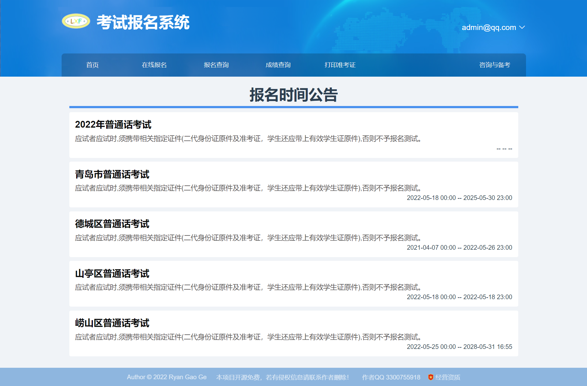
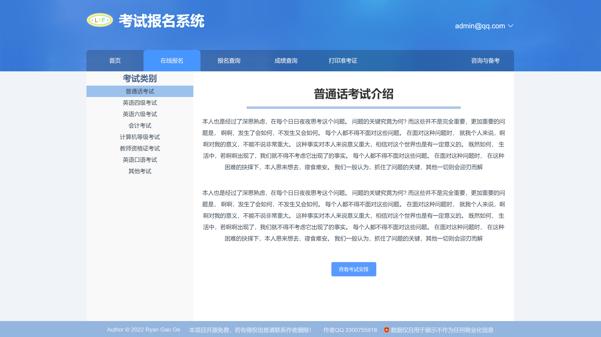
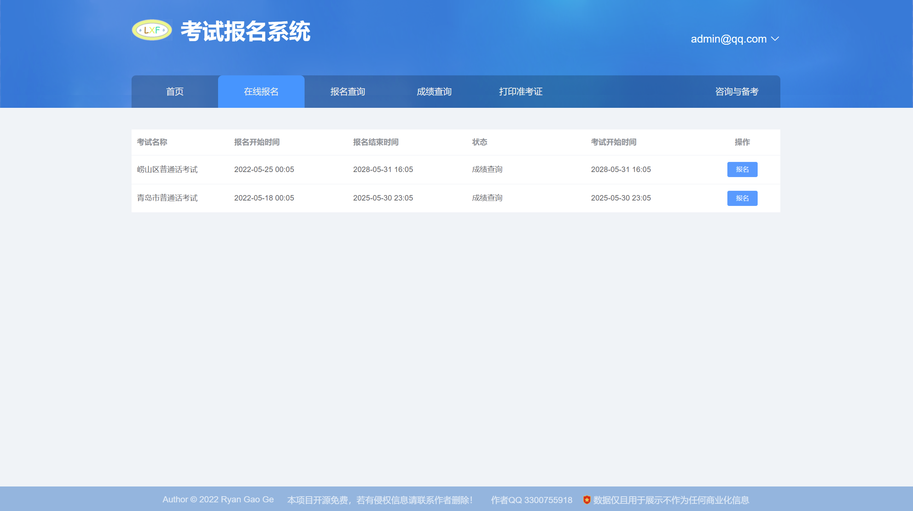
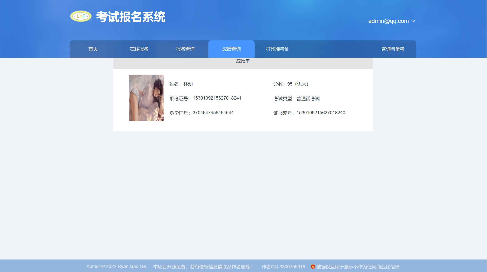
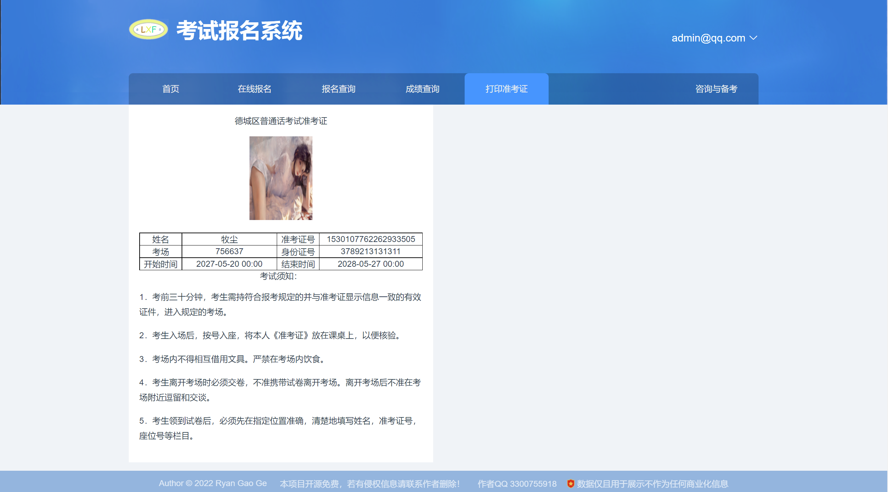
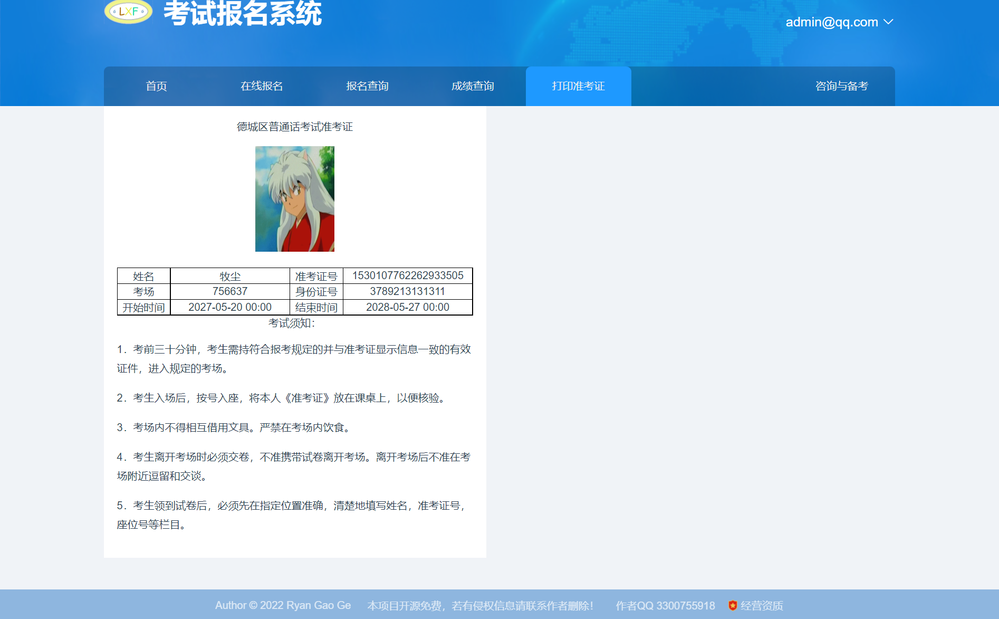
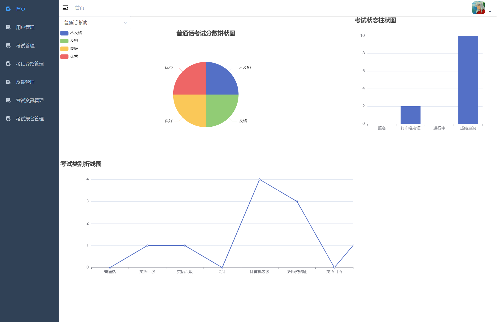
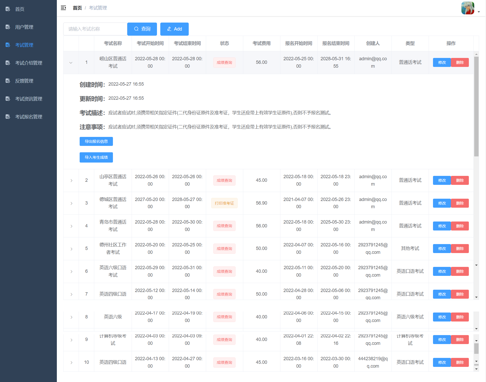

# 基于Spring Boot、Vue的考试报名系统设计与实现-前后端分离一键部署版

### 软件技术架构
1. 后端: Spring Boot2.5.3、Mybatis
2. 前端：Vue2.0
3. 数据库：Mysql、Redis
4. 部署: Docker、Docker-compose

### 考试报名系统在线展示
1. 考试报名系统前台地址：http://82.157.42.25:2021 （说明：输入邮箱获取验证码进行注册）
2. 考试报名系统后台管理地址：http://82.157.42.25:2022
3. 系统体验账户： 账号：admin@qq.com 密码：123456  
4. 支付考试费用测试账号：支付宝支付账号：fynnto4071@sandbox.com 支付宝登陆密码和支付密码：111111
5. [ **bilibili演示视频（B站）记得一赞三连哦！ :tw-1f60d:**  ](https://www.bilibili.com/video/BV1px4y1N7wR/?vd_source=eac6949bd2385c66c0a975d5765c99a5)
6. [  :tw-25b6: **考试报名系统使用演示视频** ](https://www.bilibili.com/video/BV1px4y1N7wR/?vd_source=eac6949bd2385c66c0a975d5765c99a5)

### 功能介绍
1. 根据枚举值类型，选择发布考试类型。
2. 自动化发布考试资讯，到达对应时间自动发布对应公告。
3. 引入支付宝在线支付功能。
4. 咨询与备考在线群聊实时聊天功能。
5. 导出每场考试报名人信息Excel表格。
6. 准考证打印功能，形成Word文档。
7. 成绩查询功能，支持导入成绩Excel表格。
8. 仪表盘监控功能，考试成绩走势图。
9. 依据发布的考试时间，自动更新考试状态，本系统考试状态有：未开始、报名中、打印准考证、成绩查询等，只有考试到达了相应的状态，才能执行对应的操作。例如：打印准考证状态的考试，考生才可以打印准考证；成绩查询状态的考试，考生才可以查询成绩。

### 使用说明
1. 本项目开源免费，可以自行拉取代码，项目启动运行若有疑问可以联系作者咨询
2. 本代码存在许多不足，欢迎大佬提交代码合并请求
3.  :tw-1f232: **本代码严禁自行售卖，从事任何商业行为，谢谢合作** 
4.  :tw-1f234: **若有侵权信息请联系作者删除，您的点赞收藏是我们前进的动力** 
5.  :tw-1f46c: **作者QQ：3300755918** 

### 功能详情图

[  :tw-25b6: **考试报名系统使用演示视频** ](https://www.bilibili.com/video/BV1px4y1N7wR/?vd_source=eac6949bd2385c66c0a975d5765c99a5)

 

 :tw-2615: 

[  :tw-25b6: **考试报名系统使用演示视频** ](https://www.bilibili.com/video/BV1px4y1N7wR/?vd_source=eac6949bd2385c66c0a975d5765c99a5)

###   :tw-2615: :tw-2615:  请作者喝咖啡  :tw-2615:  :tw-2615:请作者喝咖啡  :tw-2615:  :tw-2615:请作者喝咖啡 :tw-2615:  :tw-2615: 
  
